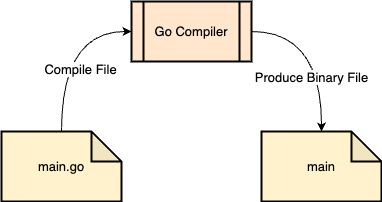

# Pengenalan Golang

## Sejarah Golang

* Dibuat di Google menggunakan bahasa pemrograman C
* Di Rilis ke public sebagai open-source pada tahun 2009
* Golang populer digunakan untuk membuat Docker pada tahun 2011
* Saat ini mulai banyak teknologi baru yang dibuat menggunakan bahasa Golang dibanding bahas C, seperti :&#x20;
  * Kubernetes
  * Prometheus
  * CockroachDB
  * dan lain-lain
* Saat ini mulai populer untuk pembuatan Backend API di Microservices ( karena lightweight )

## Kenapa Belajar Golang

* Bahasa Golang sangat sederhana, tidak butuh waktu lama untuk mempelajarinya ( contoh di Golang tidak ada OOP )
* Golang mendukung baik concurrency programming, dimana saat ini kita hidup di zaman multicore processor
* Golang mendukung garbage collector, sehingga tidak butuh melakukan management memory secara manual seperti di bahasa C
* Salah satu bahasa pemrograman yang sedang naik daun

## Proses Development Program Golang

Golang itu adalah bahasa pemrograman yang di compile berbeda dengan PHP atau Javascript yang tidak di compile.

Binary yang dihasilkan dari compiler Go itu bisa langsung di jalankan dengan sistem operasi yang digunakan tanpa harus install Go Compiler lagi.
